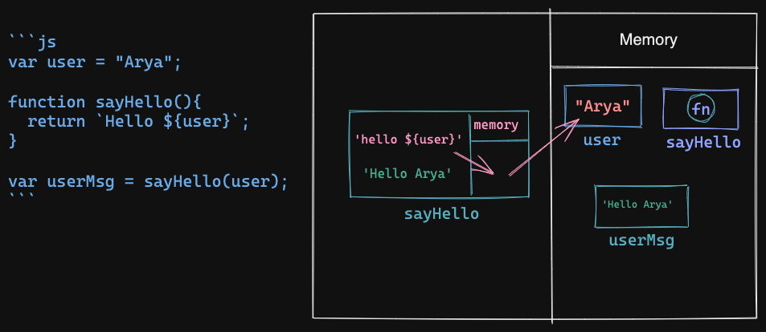
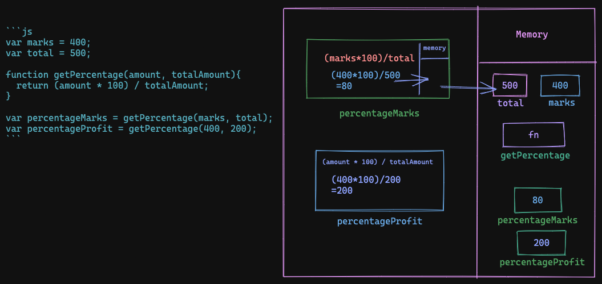
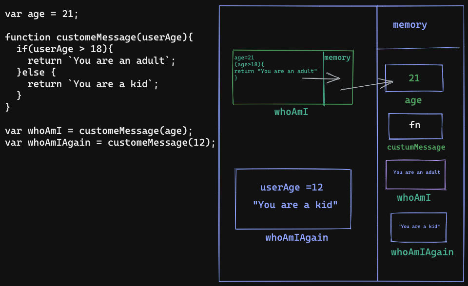

1. What does thread of execution means in JavaScript?
 The code is being stepped through line by line.

2. Where the JavaScript code gets executed?
Everything in JavaScript happens inside an "Execution Context”.
//JavaScript Engine

3. What does context means in Global Execution Context?
It take every piece of and execut in global execution contaext.

4. When do you create a global execution context.

It creates a global scope.
It creates an object known as 'this.'

5. Execution context consists of what all things?

6. What are the different types of execution context?
Global Execution Context (GEC)
Function Execution Context (FEC)

7. When global and function execution context gets created?

8. Function execution gets created during function execution or while declaring a function.

Creation Stage: This stage creates all the scopes and variables and functions. Also sets the 'this' context.
Execution Stage: This stage actually executes the code like console.log( ) statements by sending machine understandable commands.

9. Create a execution context diagram of the following code on your notebook. Take a screenshot/photo and store it in the folder named `img`. Use `` to display it here.


```js
var user = "Arya";

function sayHello(){
  return `Hello ${user}`;
}

var userMsg = sayHello(user);
```

<!-- Put your image here -->




```js
var marks = 400;
var total = 500;

function getPercentage(amount, totalAmount){
  return (amount * 100) / totalAmount;
}

var percentageMarks = getPercentage(marks, total);
var percentageProfit = getPercentage(400, 200);
```

<!-- Put your image here -->




```js
var age = 21;

function customeMessage(userAge){
  if(userAge > 18){
    return `You are an adult`;
  }else {
    return `You are a kid`;
  }
}

var whoAmI = customeMessage(age);
var whoAmIAgain = customeMessage(12);
```

<!-- Put your image here -->

